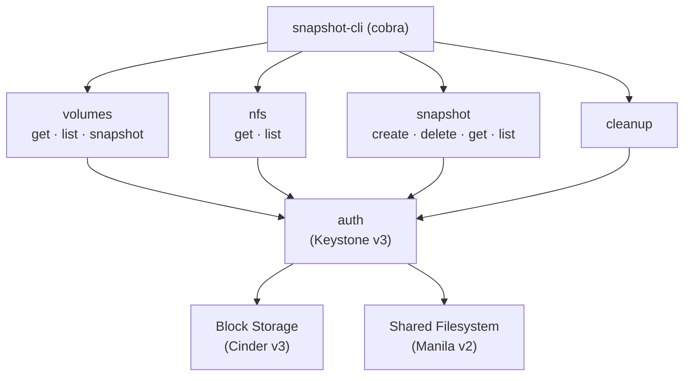
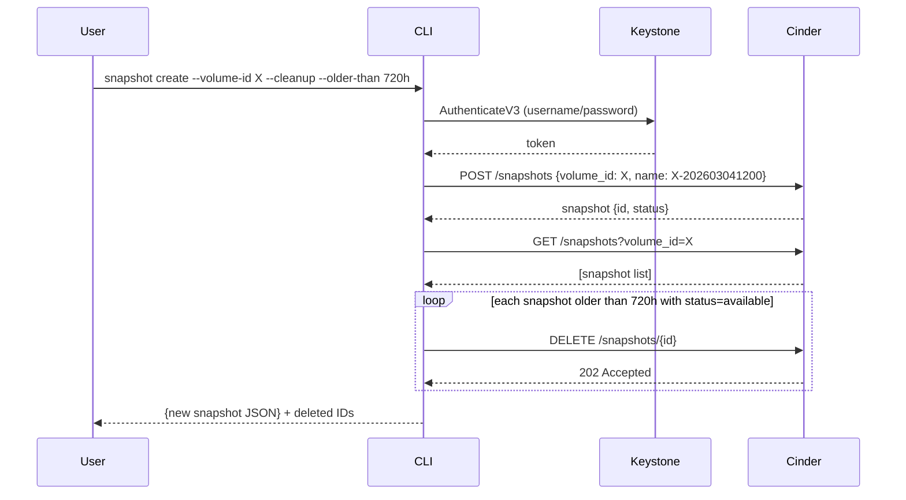
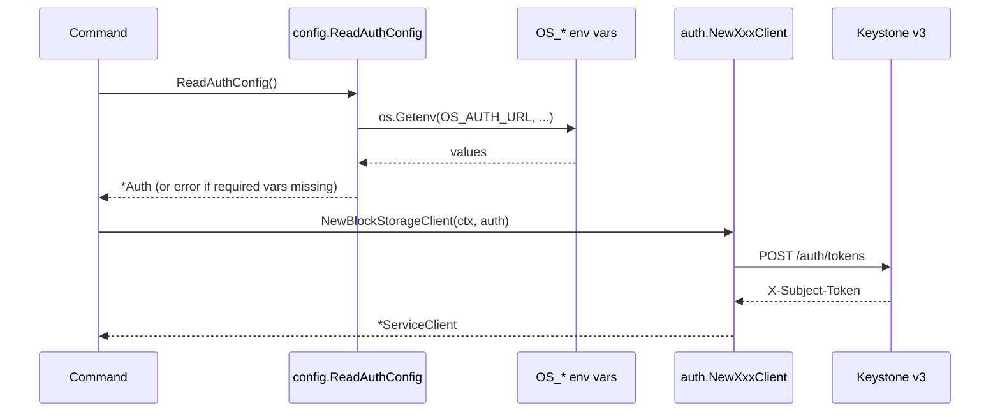

# snapshot-cli

[](https://github.com/kengou/snapshot-cli/actions/workflows/test.yaml)
[](https://github.com/kengou/snapshot-cli/actions/workflows/docker-build.yaml)
[](https://securityscorecards.dev/viewer/?uri=github.com/kengou/snapshot-cli)
[](LICENSE)

Command-line client for managing snapshots on OpenStack block storage (Cinder) and shared filesystems (Manila).

## Architecture



## Prerequisites

- Go 1.26+
- An OpenStack environment with Cinder and/or Manila

## Build

```bash
make build          # produces bin/snapshot-cli
make test           # run unit tests
make lint           # run golangci-lint
make docker         # build container image
```

Or install directly:

```bash
go install github.com/kengou/snapshot-cli/cmd/snapshot-cli@latest
```

## Authentication

All commands authenticate via environment variables sourced from an OpenStack RC file:

| Variable | Required | Description |
|----------|----------|-------------|
| `OS_AUTH_URL` | Yes | Keystone identity endpoint |
| `OS_USERNAME` | Yes | OpenStack username |
| `OS_PASSWORD` | Yes | OpenStack password |
| `OS_USER_DOMAIN_NAME` | Yes | Domain of the user |
| `OS_PROJECT_NAME` | Yes | Target project name |
| `OS_PROJECT_DOMAIN_NAME` | Yes | Domain of the project |
| `OS_REGION_NAME` | No | Region for endpoint resolution |

```bash
source openstack-rc.sh
snapshot-cli snapshot list --volume
```

## Global Flags

| Flag | Description |
|------|-------------|
| `-h`, `--help` | Help for any command |
| `-v`, `--version` | Print version information |

## Commands

### `snapshot` — Snapshot management

#### `snapshot create`

Create a snapshot of a block storage volume or shared filesystem.
Exactly one of `--volume-id` / `--share-id` is required (mutually exclusive).

```bash
snapshot-cli snapshot create --volume-id <id> [flags]
snapshot-cli snapshot create --share-id  <id> [flags]
```

| Flag | Description | Default |
|------|-------------|---------|
| `--volume-id` | ID of the block storage volume to snapshot | |
| `--share-id` | ID of the shared filesystem to snapshot | |
| `--name` | Base snapshot name; a UTC timestamp suffix (`-YYYYMMDDhhmm`) is always appended. Defaults to the resource ID | |
| `--description` | Snapshot description | |
| `--force` | Force snapshot even if volume is in-use (block storage only) | `false` |
| `--cleanup` | Delete snapshots older than `--older-than` after creating | `false` |
| `--older-than` | Age threshold for cleanup, e.g. `168h`, `720h` (minimum `1h`) | `168h0m0s` |
| `--output` | Output format: `json`, `table` | `json` |

With `--cleanup`, a single JSON document is emitted:
`{"snapshot": {...}, "deleted_snapshots": ["<id>", ...]}`. If the cleanup step
fails after the snapshot was created, a warning is printed to stderr and the
command still exits 0 — retrying would create a duplicate snapshot.

**Examples:**

```bash
# Create a block storage snapshot and clean up snapshots older than 30 days
snapshot-cli snapshot create \
  --volume-id abc-123 \
  --name weekly-backup \
  --cleanup \
  --older-than 720h \
  --output table

# Create an NFS share snapshot
snapshot-cli snapshot create --share-id def-456 --description "pre-migration"
```

---

#### `snapshot list`

List all snapshots. Exactly one of `--volume` / `--share` is required.

```bash
snapshot-cli snapshot list --volume [flags]
snapshot-cli snapshot list --share  [flags]
```

| Flag | Description | Default |
|------|-------------|---------|
| `--volume` | List block storage snapshots | `false` |
| `--share` | List shared filesystem snapshots | `false` |
| `--output` | Output format: `json`, `table` | `json` |

---

#### `snapshot get`

Retrieve details of a single snapshot. Exactly one of `--volume` / `--share` is required.

```bash
snapshot-cli snapshot get --snapshot-id <id> --volume [flags]
snapshot-cli snapshot get --snapshot-id <id> --share  [flags]
```

| Flag | Description | Default |
|------|-------------|---------|
| `--snapshot-id` | ID of the snapshot to retrieve (required) | |
| `--volume` | Retrieve a block storage snapshot | `false` |
| `--share` | Retrieve a shared filesystem snapshot | `false` |
| `--output` | Output format: `json`, `table` | `json` |

---

#### `snapshot delete`

Delete a snapshot by ID. Exactly one of `--volume` / `--share` is required.

```bash
snapshot-cli snapshot delete --volume --snapshot-id <id> [flags]
snapshot-cli snapshot delete --share  --snapshot-id <id> [flags]
```

| Flag | Description | Default |
|------|-------------|---------|
| `--snapshot-id` | ID of the snapshot to delete (required) | |
| `--volume` | Delete a block storage snapshot | `false` |
| `--share` | Delete a shared filesystem snapshot | `false` |
| `--output` | Output format: `json`, `table` | `json` |

On success the command prints a confirmation: `{"deleted": "<snapshot-id>"}`.

---

### `cleanup` — Delete old snapshots

Delete all snapshots older than a given duration. Exactly one of `--volume` / `--share` is required.
Optionally scope deletion to a specific volume or share.

```bash
snapshot-cli cleanup --volume [flags]
snapshot-cli cleanup --share  [flags]
```

| Flag | Description | Default |
|------|-------------|---------|
| `--volume` | Clean up block storage snapshots | `false` |
| `--share` | Clean up shared filesystem snapshots | `false` |
| `--volume-id` | Restrict cleanup to snapshots of this volume | |
| `--share-id` | Restrict cleanup to snapshots of this share | |
| `--older-than` | Delete snapshots older than this duration (minimum `1h`) | `168h0m0s` |
| `--dry-run` | List the snapshots that would be deleted without deleting them | `false` |
| `--output` | Output format: `json`, `table` | `json` |

**Examples:**

```bash
# Delete all volume snapshots older than 7 days
snapshot-cli cleanup --volume --older-than 168h

# Delete NFS snapshots older than 30 days for a specific share
snapshot-cli cleanup --share --share-id def-456 --older-than 720h
```

---

### `volumes` — Block storage volume management

#### `volumes list`

List all block storage volumes in the project.

```bash
snapshot-cli volumes list
```

#### `volumes get`

Retrieve details of a specific volume.

```bash
snapshot-cli volumes get --volume-id <id>
```

| Flag | Description |
|------|-------------|
| `--volume-id` | Volume ID (required) |

#### `volumes snapshot`

Create a snapshot of a block storage volume.

```bash
snapshot-cli volumes snapshot --volume-id <id> [flags]
```

| Flag | Description |
|------|-------------|
| `--volume-id` | Volume ID (required) |
| `--name` | Snapshot name (optional) |
| `--description` | Snapshot description (optional) |
| `--force` | Force snapshot creation |
| `--output` | Output format: `json`, `table` | `json` |

---

### `nfs` — Shared filesystem management

#### `nfs list`

List all shared filesystems (Manila shares) in the project.

```bash
snapshot-cli nfs list
```

#### `nfs get`

Retrieve details of a specific shared filesystem.

```bash
snapshot-cli nfs get --share-id <id>
```

| Flag | Description |
|------|-------------|
| `--share-id` | Share ID (required) |

---

## Container

The image is built with distroless/static and runs as non-root (UID 65532):

```bash
docker build -t snapshot-cli:latest .
docker run --env-file openstack.env snapshot-cli:latest snapshot list --volume
```

## Observability

snapshot-cli includes OpenTelemetry distributed tracing for production observability. Traces are **disabled by default** and require an external collector.

### Quick Start

Run Jaeger locally and export traces:

```bash
# Start Jaeger (with OTEL gRPC receiver on port 4317)
docker run --rm -p 4317:4317 -p 16686:16686 jaegertracing/all-in-one

# Export traces to Jaeger (http:// scheme = no TLS; use https:// for TLS)
export OTEL_EXPORTER_OTLP_ENDPOINT=http://localhost:4317
snapshot-cli snapshot create --volume-id abc-123

# View traces: http://localhost:16686
```

### Configuration

Tracing is enabled only when an endpoint variable is set. The exporter honors
the standard `OTEL_EXPORTER_OTLP_*` environment variables:

| Variable | Description |
|----------|-------------|
| `OTEL_EXPORTER_OTLP_ENDPOINT` | gRPC collector endpoint (e.g., `http://localhost:4317`) |
| `OTEL_EXPORTER_OTLP_TRACES_ENDPOINT` | Traces-specific endpoint override |

### Instrumented Operations

- Authentication (Keystone, Cinder init, Manila init)
- Snapshot CRUD (create, delete, list, get, cleanup)

See [`internal/observability/README.md`](internal/observability/README.md) for complete documentation.

## Data Flow

### `snapshot create --cleanup`



### Authentication flow



## Troubleshooting

| Symptom | Likely cause | Fix |
|---------|-------------|-----|
| `missing OS_AUTH_URL, OS_PASSWORD, ...` | OpenStack RC not sourced | `source openstack-rc.sh` |
| `Authentication failed` | Wrong credentials or expired password | Verify `OS_USERNAME` / `OS_PASSWORD` |
| `No endpoint found for block-storage` | Region mismatch or Cinder v3 not enabled | Set `OS_REGION_NAME` correctly; check OpenStack has Cinder enabled |
| `No endpoint found for shared-file-system` | Region mismatch or Manila v2 not enabled | Set `OS_REGION_NAME` correctly; check OpenStack has Manila enabled |
| `Resource not found` | Invalid volume/share/snapshot ID | Confirm ID with `volumes list` or `nfs list` |
| `Volume is in use` | Volume has active attachments | Use `--force` flag (block storage only) |
| Command produces no output | Unrecognised `--output` value | Use `json` or `table` |

## Contributing

1. Fork and create a feature branch
2. Run `make lint` and `make test` before committing
3. Open a pull request against `main`
